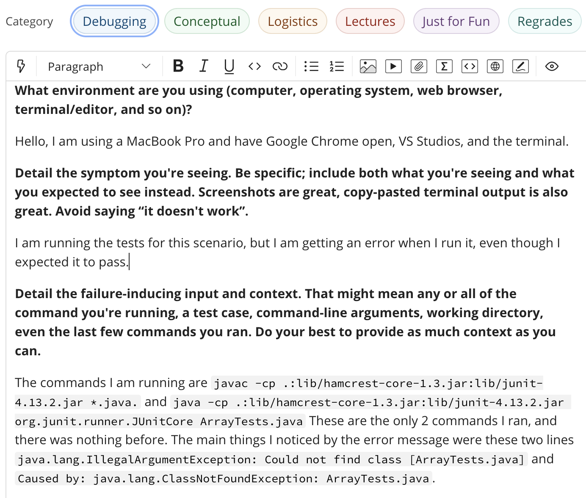
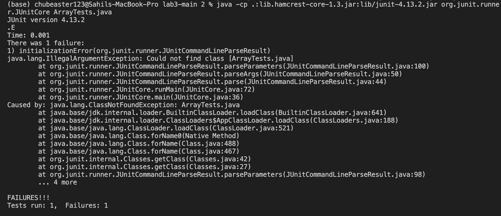
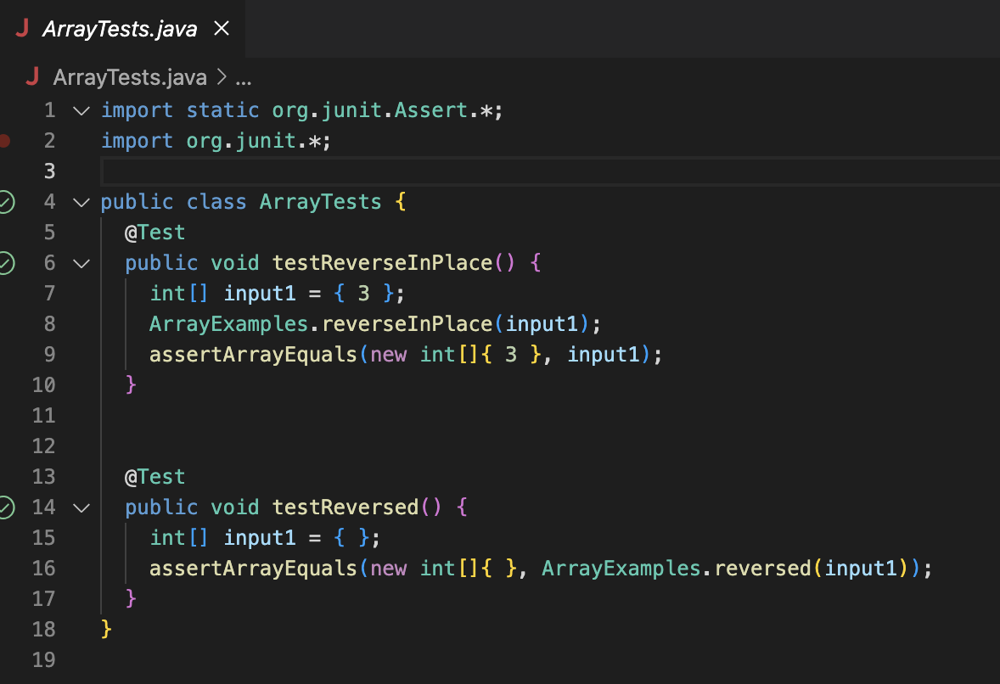
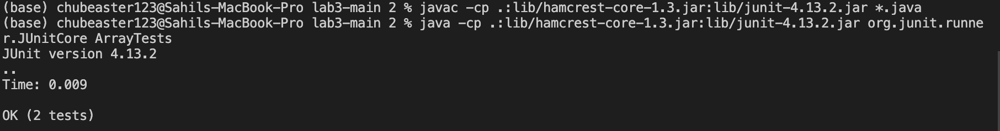

# Part 1 - Debugging Scenario

Here is a screenshot of the error I am receiving.

Here is a screenshot of my code.

# 1) 
Response from TA: Hello, try looking more into why the error message "java.lang.IllegalArgumentException: Could not find class [ArrayTests.java]" is appearing. It could be because of the `.java` at the end of the bash script.

# 2)
Thank you for the advice I was able to remove the `.java` and the tests were able to run successfully.

# 3)
We are in a cloned resository of lab3-main. If you were to type `ls` and hit enter it would list all the files that you would
see on vs studios. When we are running our 2 bash commands we have -cp in the beginning for both of them in order to change the path
to the right file. The code itself had no errors. There was just an error in running the bash commands. The bug was caused 
by this line, `java -cp .:lib/hamcrest-core-1.3.jar:lib/junit-4.13.2.jar org.junit.runner.JUnitCore ArrayTests.java`. In 
order to fix the bug we had to get rid of the .java so the final result was `java -cp .:lib/hamcrest-core-1.3.jar:lib/junit-4.13.2.jar org.junit.runner.JUnitCore ArrayTests`.

# Part 2 - Reflection
Something I found interesting that I learned in lab recently was about using VIM. I never knew about it and how you could acess it through
terminal. I found it cool how you could enter a specific mode and memorize all these shortcuts to view and edit code. The tutorial on terminal helped a lot with practice. 

